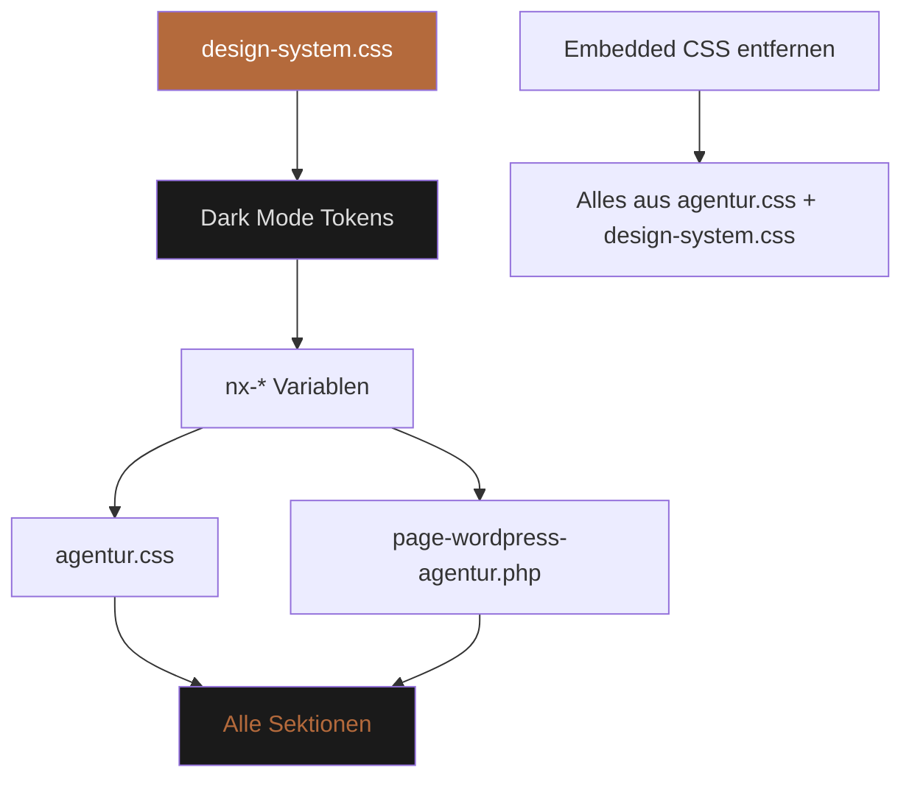
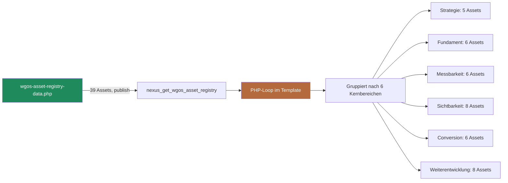
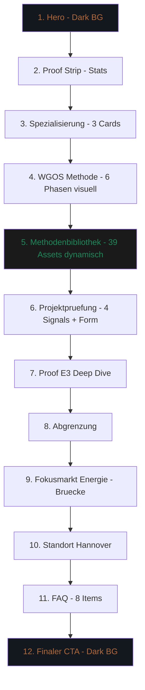

# Plan: WordPress Agentur Hannover – Champions-League Relaunch

Stand: 2026-05-15 | Mode: Architect | Ziel: Code-Implementierung vorbereiten

---

## Ausgangslage: Was wir vorgefunden haben

### Architektur-Ist-Zustand

Die Agentur-Seite (`page-wordpress-agentur.php`) ist ein **Hardcoded Template** mit:
- **Embedded CSS** (~850 Zeilen) direkt im `<style>`-Tag – definiert ein **komplett eigenes Light-Mode-System** mit `--background: #F6F4EF` (Creme), eigenen Font-Tokens und Button-Stilen
- **Zusätzliches externes CSS**: `agentur.css` (1411 Zeilen) – nutzt bereits das globale Dark-Mode-Design-System (`--nx-*` Variablen), greift aber auf Klassen, die im Template nicht existieren
- **39 WGOS-Assets** als statische HTML-Cards in 6 Accordion-Gruppen (Strategie, Fundament, Messbarkeit, Sichtbarkeit, Conversion, Weiterentwicklung) – **hart codiert, nicht aus der Registry dynamisiert**

### Die 3 Kernprobleme

| # | Problem | Ursache | Impact |
|---|---------|---------|--------|
| 1 | **Design-Kontrast-Mismatch** | Das Template definiert ein eigenes Light-System, `agentur.css` nutzt das globale Dark-System. Die mittleren Sektionen (WGOS-Assets, Proof, Spezialisierung) fallen in einen undefinierten Mischzustand. | Schlechte Lesbarkeit, kein Marken-Wiedererkennungswert |
| 2 | **39 Assets statisch dupliziert** | Die WGOS-Assets sind als HTML-Cards ins Template geschrieben, obwohl sie bereits als versionierte Registry (`wgos-asset-registry-data.php`) mit 39 `publish`-Assets und eigener CPT-Infrastruktur existieren | Inkonsistenz zwischen Registry und Page, Wartungsalptraum |
| 3 | **Light-Mode-Insel im Dark-System** | Die gesamte Website (`design-system.css`) ist auf Dark Mode (`[data-theme='dark']`) festgelegt. Die Agentur-Seite reißt mit eigenem `--background: #F6F4EF` eine Light-Insel auf. | Bruch in User Experience, SEO-Signal-Inkonsistenz |

---

## Strategische Einordnung (aus Deiner Recherche)

Deine Analyse zeigt den klaren Pfad:

- Die Agentur-Seite ist **SEO-Anker für "WordPress Agentur Hannover"** – sekundärer Money-Page-Pfad neben dem Solar-Marktcheck
- Sie dient als **B2B-Vertrauensfläche** mit Hannover-Standortsignal
- Der primäre CTA ist **Projektprüfung** (nicht Marktcheck – das ist der Solar-Pfad)
- Die WGOS-Methode ist das **E-E-A-T-Fundament** – muss sichtbar bleiben, aber **nicht als 39-Block-Wand**
- Die **E3-Proof-Zahlen** (150€→22€ CPL, 1.750+ Leads, 12% Abschlussquote) sind der stärkste Conversion-Hebel

### Was die BRAND_AND_COPY.md sagt (Konflikt beachten!)

Die Brand-Richtlinien listen `WGOS` als **Anti-Pattern**: *"Legacy-Framework, wird nicht mehr aktiv verkauft, zugehörige Seite ist noindex."*

**Aber LIVE_STATUS sagt**: *"Die WGOS-Erklärung ist in die lokale Money Page `/wordpress-agentur-hannover/#wgos` konsolidiert."*

➡️ **Auflösung**: WGOS ist auf der Agentur-Seite nicht als "Produkt" positioniert, sondern als **methodischer Glaubwürdigkeitsanker**. Die 39 Bausteine sind E-E-A-T-Signale, keine Verkaufsargumente. Die Seite verkauft **Projektprüfung**, nicht WGOS.

---

## Zielarchitektur

### Seiten-Sektionen (neu geordnet)

```
1. HERO (Above the Fold)
   – Standortsignal + B2B-Claim
   – E3-Daten-Chart (visuell, nicht nur Text)
   – Dual-CTA: Projekt prüfen (primär) / E3-Case (sekundär)

2. PROOF-STRIP (Stats)
   – E3-Kennzahlen als Vertrauensanker
   – 150€→22€ / 1.750+ / 12% / 85%

3. SPEZIALISIERUNG
   – "Kein lokaler Allrounder"
   – Was / Für wen / Womit – 3 Karten

4. METHODE (WGOS kompakt)
   – Kein 39er-Wust: 6 Kernbereiche visuell
   – Interaktives System-Diagramm
   – "Die Reihenfolge entscheidet, nicht der Katalog"

5. METHODENBIBLIOTHEK (WGOS Assets)
   – Dynamisch aus Registry (39 Assets, publish-only)
   – Accordion nach 6 Kernbereichen
   – Jeder Bereich zeigt Asset-Cards mit Kurzbeschreibung
   – Kein Copy-Paste-HTML mehr

6. PROJEKTPRÜFUNG
   – 4 Kauf-Signale (Angebot/Nachfrage/Datenlage/Anfragepfad)
   – Embedded Contact Form (type=project)
   – CTA: Projekt prüfen

7. PROOF (E3 Deep Dive)
   – Referenz-Case mit harten Zahlen
   – "Keine pauschale Übertragbarkeitsgarantie"

8. ABGRENZUNG
   – Für wen nicht (One-Page, Shopify, reine Design-Relaunches)

9. FOKUSMARKT ENERGIE
   – Brücke zur Solar-Seite
   – CTA: Zum Marktcheck

10. STANDORT
    – Hannover/DACH-Signal + Wartung

11. FAQ (Accordion)
    – 8 kaufnahe Fragen mit FAQPage-Schema

12. FINALER CTA (Dark Section)
    – Projekt prüfen + E3-Case
```

### Design-System-Integration



### WGOS-Dynamisierung



---

## Priorisierte Implementierungs-Schritte

### Phase 1: Design-Konsolidierung (Fundament)

**Ziel**: Die Agentur-Seite ins globale Dark-Mode-Design-System überführen. Kein eigenes Light-System mehr.

- [ ] **1.1 Embedded CSS aus `page-wordpress-agentur.php` entfernen** – alle `<style>`-Regeln (Zeilen 19-858) löschen
- [ ] **1.2 `agentur.css` als alleiniges Stylesheet prüfen und ergänzen** – fehlende Utility-Klassen für Hero, Stats, Cards, Buttons aus dem Design-System übernehmen
- [ ] **1.3 Dark-Mode-Readability prüfen**: `--nx-text` (hsl 30 4% 90%) auf `--nx-bg-deep` (hsl 30 6% 5%) – Kontrastverhältnis > 15:1, exzellent
- [ ] **1.4 Copper-Akzent konsistent**: `--accent: #b46a3c` / `--nx-accent-text` für CTAs, Eyebrows, Hervorhebungen
- [ ] **1.5 Typografie vereinheitlichen**: Figtree (Body) + Satoshi (Headlines) aus `design-system.css`

### Phase 2: WGOS-Assets dynamisieren (Content-Architektur)

**Ziel**: Keine statischen HTML-Cards mehr. Assets aus der Registry rendern.

- [ ] **2.1 PHP-Helper im Template**: `nexus_get_wgos_asset_registry()` aufrufen, nach `core_area` gruppieren
- [ ] **2.2 Accordion-Logik beibehalten** – 6 Kernbereiche als Sections, Assets als Cards darin
- [ ] **2.3 Asset-Card-Template**: Icon, Titel, Kurzbeschreibung aus Registry-Feldern (`excerpt`, `goal`)
- [ ] **2.4 "Nur publish"-Filter**: Nur Assets mit `status: publish` rendern (aktuell alle 39)
- [ ] **2.5 WGOS-Methoden-Intro-Sektion** (vor der Bibliothek): Kompakte Erklärung der 6 Phasen als visuelles System-Diagramm, nicht als Textwand

### Phase 3: CRO- und UX-Optimierung (Conversion)

**Ziel**: Reibung reduzieren, Entscheider schneller zur Projektprüfung führen.

- [ ] **3.1 Hero-Visualisierung**: E3-CPL-Daten als Chart/Visual neben dem Claim (nicht nur Text-Badge)
- [ ] **3.2 Progressive Disclosure für WGOS**: Accordion-Gruppen sind gut, aber der erste Eindruck muss die 6-Bereich-Struktur sofort erkennbar machen (Tabs oder visuelles Grid vor dem Aufklappen)
- [ ] **3.3 Sticky Mobile CTA**: "Projekt prüfen" als fixierter Button am unteren Bildschirmrand auf Mobile
- [ ] **3.4 Micro-Commitment-Formular**: Projektprüfungs-Formular (existiert bereits via `contact.js` mit `type=project`) – prüfen ob Multi-Step möglich
- [ ] **3.5 Trust-Signale visuell**: Partner-Badges, Schema-Markup-Validierung, GitHub-Transparenz als visuelle Trust-Elemente

### Phase 4: SEO- und Schema-Härtung (Local Authority)

**Ziel**: Top-5-Ranking für "WordPress Agentur Hannover" absichern.

- [ ] **4.1 FAQPage-Schema**: Die 8 FAQ-Items sind bereits im Template – prüfen ob `org-schema.php` sie korrekt als JSON-LD ausgibt
- [ ] **4.2 LocalBusiness-Schema**: NAP-Daten, Geokoordinaten, Öffnungszeiten aus dem Google Business Profile abgleichen
- [ ] **4.3 Interne Verlinkung**: WGOS-Asset-Cards verlinken auf `/wgos-assets/[slug]` (Detailseiten) – Pillar-to-Cluster-Signale
- [ ] **4.4 Breadcrumb**: Agentur > Asset (wo relevant)
- [ ] **4.5 Title/Meta prüfen**: Aktuell via `seo-meta.php` – "WordPress Agentur Hannover – SEO, Wartung & Conversion" beibehalten

---

## Sektionen-Diagramm (kompletter Flow)



---

## Dateien, die geändert werden müssen

| Datei | Art der Änderung | Phase |
|-------|-----------------|-------|
| `blocksy-child/page-wordpress-agentur.php` | **Rewrite**: Embedded CSS entfernen, Template auf Design-System-Klassen umstellen, WGOS-Assets aus Registry dynamisieren | 1+2+3 |
| `blocksy-child/assets/css/agentur.css` | **Erweitern**: Fehlende Design-System-Utility-Klassen ergänzen, Light-Mode-Regeln entfernen, Contrast-Fixes | 1 |
| `blocksy-child/inc/enqueue.php` | **Prüfen**: `nexus-agentur-css` hängt bereits an `homepage.css` + `contact.css` – Reihenfolge okay | – |
| `blocksy-child/inc/wgos/wgos-asset-registry.php` | **Read-only**: Registry-Funktionen werden vom Template aufgerufen – kein Code-Change nötig | 2 |

---

## Nicht anfassen (Assets bleiben)

- `blocksy-child/assets/img/landing/*` – alle Bilder bleiben
- `blocksy-child/assets/brand/*` – Logos, Favicons bleiben
- `blocksy-child/fonts/*` – Satoshi, Figtree, Outfit bleiben
- `blocksy-child/inc/wgos/wgos-asset-registry-data.php` – Registry-Daten bleiben
- `blocksy-child/assets/html/wgos-social-proof.html` – Social Proof Partial bleibt
- `blocksy-child/template-parts/*` – Header, Footer, Breadcrumb, Footer-CTA bleiben
